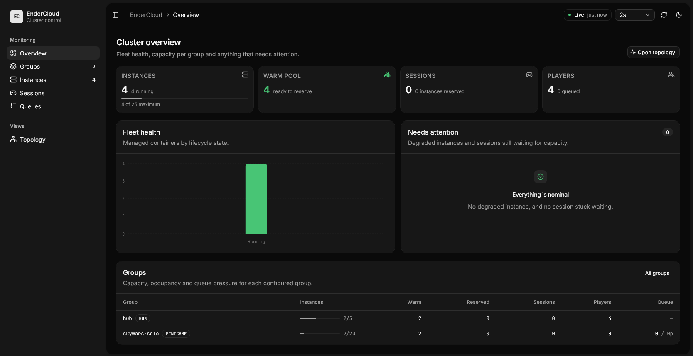
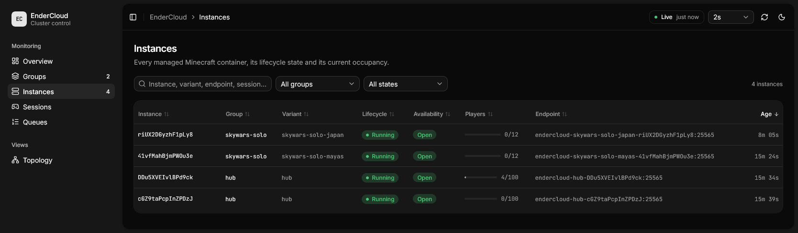

# EnderCloud

EnderCloud is a modular monolithic orchestrator for disposable Minecraft servers. PostgreSQL
stores every durable decision, Redis broadcasts ephemeral proxy events, and Docker runs
instances copied from immutable template directories.





Managed Minecraft containers use the name
Docker containers use `endercloud-<variant-id>-<instance-id>`; Velocity registers them as
`ec-<variant-id>-<instance-id>`.

## Repository layout

- `orchestrator/`: Bun, TypeScript, Elysia, Drizzle and the local Docker executor.
- `dashboard/`: console Next.js, React Flow, TanStack Query et shadcn/ui.
- `plugins/core`: platform-neutral Java 25 client, contracts and integration APIs.
- `plugins/velocity`: dynamic server registry, transfers and hub fallback.
- `plugins/paper`: readiness, player presence and game lifecycle bridge.
- `groups/`: logical matchmaking and capacity policies loaded at startup.
- `templates/`: complete immutable server variants.
- `runtime/`: disposable per-instance copies; never commit its contents.

The provided groups are intentionally disabled because the repository does not ship a playable
Minecraft map or game plugin.

## Build and test

Requirements are Bun 1.3+, JDK 25, Docker and Docker Compose.

```powershell
cd orchestrator
bun install --frozen-lockfile
bun run typecheck
bun test

cd ../plugins
./gradlew build

cd ../dashboard
bun install --frozen-lockfile
bun run lint
bun run typecheck
bun test
bun run build
```

The platform JARs are produced as:

- `plugins/core/build/libs/EnderCloudCore-0.1.0.jar`
- `plugins/paper/build/libs/EnderCloudPaper-0.1.0.jar`
- `plugins/velocity/build/libs/EnderCloudVelocity-0.1.0.jar`

Both are shaded. Platform APIs themselves remain `compileOnly`.

## Run the infrastructure

Copy `.env.example` to `.env` and set `RUNTIME_HOST_ROOT` to the absolute path of this
repository's `runtime` directory exactly as it is seen by the Docker daemon. With Docker Desktop
this may be a VM mount such as `/run/desktop/mnt/host/c/...`, rather than a Windows path. This
second path is needed
because the orchestrator controls the host daemon through its socket, while it sees the same
files through `/data/runtime`.

```powershell
docker compose up --build
```

Le dashboard est alors disponible sur `http://localhost:3000` (ou le port défini par
`DASHBOARD_PORT`). Son proxy serveur ne permet que les quatre routes de lecture du dashboard et
contacte l'orchestrateur avec `ORCHESTRATOR_URL`.

Pour le développement local, lancer l'orchestrateur puis :

```powershell
cd dashboard
Copy-Item .env.example .env.local
bun run dev
```

Pour travailler sur l'interface sans lancer l'orchestrateur, Docker ni PostgreSQL, activer
`DASHBOARD_MOCK_DATA=true` dans `dashboard/.env.local` : le dashboard sert alors un cluster
synthétique. Voir `dashboard/README.md`.

L'orchestrateur et les services internes restent sur le réseau `endercloud`. Attachez chaque
conteneur Velocity et chaque serveur Minecraft créé dynamiquement à ce même réseau.
L'orchestrateur applique les migrations et valide les YAML avant que son endpoint de readiness
réussisse.

## Enable a group

1. Build the Paper bridge and place its shaded JAR in the template's `plugins/` directory.
2. Add the complete map, server settings and game plugin to that template.
3. Add a `variant.yml` following `templates/README.md`.
4. Change the matching group to `enabled: true`.
5. Restart the orchestrator so it validates and synchronizes the YAML.

Never modify a template used by a running orchestrator. Increment `revision` after changing a
variant. Images must use an explicit tag or digest; `latest` is rejected.

## Plugin integration

Paper-side plugins obtain the service through Bukkit:

```java
EnderCloudPaperApi cloud = Bukkit.getServicesManager()
    .load(EnderCloudPaperApi.class);
```

Use it to enqueue an atomic party, leave a queue, read the current team assignment and report
`GAME_STARTING`, `GAME_STARTED` or `GAME_FINISHED`. EnderCloud deliberately adds no player
commands and no game-specific behavior.

The Velocity plugin instance implements `EnderCloudVelocityApi`. Another Velocity plugin can
retrieve the `endercloud` plugin container, obtain its instance, cast it to that interface and
request a hub transfer. Ordinary initial routing and kicked-server fallback are automatic.

## Internal protocol

OpenAPI is available at `/openapi` inside the private network. Important routes include:

- `GET /api/v1/proxy/servers`
- `GET /api/v1/dashboard/cluster`
- `GET /api/v1/dashboard/groups/{groupId}/queue`
- `GET /api/v1/dashboard/instances/{instanceId}`
- `GET /api/v1/dashboard/sessions/{sessionId}`
- `POST /api/v1/queue/entries`
- `POST /api/v1/proxy/players/{uuid}/disconnected`
- `POST /api/v1/instances/{id}/events`
- `GET /api/v1/instances/{id}/assignment`

Redis uses `minecraft:proxy:registry` and `minecraft:proxy:transfers`. Subscribers connect before
loading their HTTP snapshot and reload it after any malformed event or reconnection.

This API is intentionally unauthenticated for the MVP. Do not publish port 8080 or Redis outside
the private Docker network.
