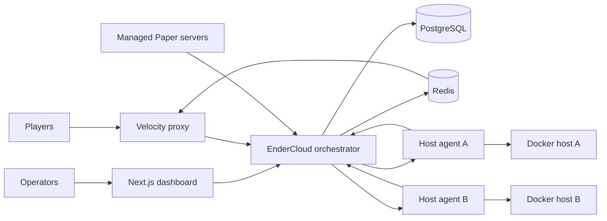
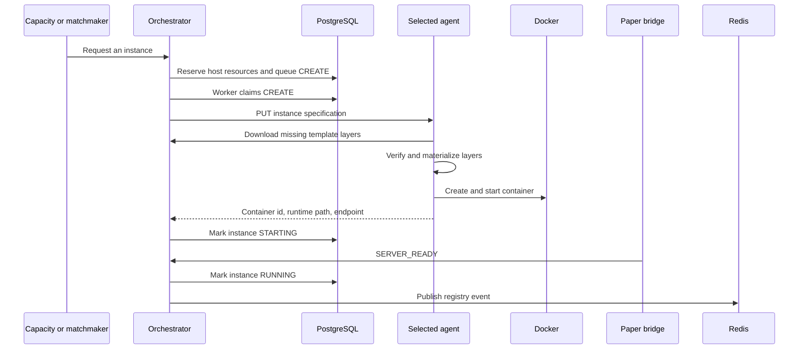

# Architecture

EnderCloud separates durable control-plane decisions from host-local Docker work. The
orchestrator decides what should exist and where it should run. Agents turn those decisions into
containers. PostgreSQL lets the orchestrator resume after a crash without guessing what was
already accepted.

## System view

All arrows in this diagram belong on trusted networks. The current APIs do not authenticate
callers.

## Components

| Component | Responsibility | State it owns |
| --- | --- | --- |
| Orchestrator | Configuration sync, placement, capacity, matchmaking, sessions, transfers, deadlines, incidents, and reconciliation | Durable control state in PostgreSQL |
| Host agent | Template cache, runtime materialization, port allocation, Docker lifecycle, inventory, inspection, and logs | Host-local cache and generated runtime files |
| PostgreSQL | Transactions, locks, reservations, state machines, commands, deadlines, metrics, and incidents | Authoritative state |
| Redis | Proxy registry notifications and transfer notifications | Ephemeral events only |
| Velocity plugin | Dynamic Minecraft server registry, transfer execution, initial hub selection, and kicked-server fallback | In-memory registry rebuilt from the orchestrator snapshot |
| Paper plugin | Readiness, player presence, TPS heartbeat, assignment cache, and game lifecycle events | In-memory assignment cache |
| Dashboard | Operational reads and confirmed maintenance or startup-retry actions | Browser state only |

The orchestrator and agent are two entry points in the same Bun package. They share contracts and
Docker executor code but run as separate processes. The orchestrator does not mount the Docker
socket.

## Orchestrator structure

`orchestrator/src/index.ts` is the composition root. It loads configuration, migrates the
database, synchronizes YAML configuration, connects Redis, constructs services, performs an
initial convergence pass, starts the HTTP API, then starts the periodic control loops.

The source tree has these roles:

| Path | Role |
| --- | --- |
| `src/domain/` | Pure state transitions and selection, capacity, matchmaking, routing, placement, and retry rules |
| `src/db/` | Drizzle schema, PostgreSQL client, JSON helpers, and migration runner |
| `src/configuration/` | YAML parsing, validation, layer checksums, inheritance resolution, and database synchronization |
| `src/services/` | Use cases and control loops for instances, hosts, queues, sessions, transfers, monitoring, and incidents |
| `src/executor/` | Executor contract, HTTP client for agents, and the agent's local Docker implementation |
| `src/events/` | Redis event bus used by Velocity |
| `src/api/` | Elysia HTTP API, validation schemas, request identifiers, and OpenAPI generation |
| `src/agent/` | Agent configuration, HTTP API, heartbeat process, and remote template cache |

The project is a modular monolith, not a set of central microservices. Service classes may use
Drizzle transactions directly. That keeps multi-row state changes in one process and one
database transaction.

## Durable state and events

PostgreSQL is authoritative for groups, variants, hosts, instances, sessions, queue entries,
players, commands, transfers, monitoring samples, incidents, and startup retry policy. A process
restart can replay pending work from these tables.

Redis is deliberately non-authoritative. It publishes two schema-versioned event streams:

- `minecraft:proxy:registry` announces server registration changes.
- `minecraft:proxy:transfers` tells Velocity to connect players to a selected instance.

Velocity subscribes before loading `GET /api/v1/proxy/servers`. It reloads that snapshot after a
Redis reconnect or an invalid event. Losing an event can delay an update, but it does not erase
the durable decision.

## Configuration flow

At orchestrator startup:

1. The migration runner applies every pending SQL migration.
2. The configuration loader reads each group YAML file and each immediate template directory.
3. It validates identifiers, capacity limits, timeouts, group-specific policies, layer
   inheritance, Docker settings, environment values, files, and image tags.
4. It computes a SHA-256 checksum for every layer and a resolved checksum for every final variant.
5. One database transaction synchronizes groups, layers, variants, and group-to-variant links.

Configuration is not watched. Restart the orchestrator after changing a group or template.
Existing instances keep their materialized files. A final variant revision identifies the
operator-approved version that new instances should use.

## Instance startup flow

The database command exists before the remote Docker call. The startup worker claims commands
with row locks and bounded concurrency. Agent create operations are idempotent for a stable
instance identifier because the agent reuses a correctly labelled container after an uncertain
response.

Only port selection and Docker container creation are serialized inside one agent. Template
materialization and image checks may run concurrently.

## Capacity and matchmaking flow

The capacity controller compares each enabled group's configured limits with active and warm
instances. It requests or drains capacity until the observed state converges. Hub routing also
uses a soft player target to request another hub before the strict per-instance limit is reached.

For a minigame group, the matchmaker reads queued parties in FIFO order, bounded by
`candidate_window`. It searches for a set of indivisible parties that satisfies the configured
player count and team profile. It creates or fills a durable session, reserves a warm instance,
and writes transfer commands. The Paper game plugin chooses the final team assignment and decides
when to publish `GAME_STARTING`.

See [Concepts](CONCEPTS.md) for the instance and session state machines.

## Host placement and reservations

Only hosts with health `ONLINE` and administration state `ACTIVE` receive new instances. Placement
subtracts the CPU and memory reserved by every physical instance that has not reached confirmed
`STOPPED`. The scheduler chooses the host with the lowest dominant utilization. Host identifier
breaks ties deterministically.

`STOPPING`, `FAILED`, and `ORPHANED` instances keep physical reservations until cleanup is
confirmed. They stop counting toward the group's logical capacity, so a replacement may start on
another host without overcommitting the original host.

## Reconciliation and recovery

An agent heartbeat upserts its stable host identity, advertised addresses, allocatable resources,
and version. After an agent disappears, the orchestrator marks its host `OFFLINE`. Returning hosts
enter `RECOVERING` and cannot receive new work yet.

The reconciler asks a recovering agent for its managed containers, compares that inventory with
PostgreSQL, deletes owned orphans, and resolves desired instances whose runtime is missing. The
host becomes `ONLINE` only after this pass succeeds. Docker ownership labels protect cleanup from
deleting unrelated containers.

## Failure boundaries

- Each scheduled loop prevents overlapping runs of the same task.
- A failed loop writes a structured log and can open an operational incident.
- Host control failures update host health without converting a network error into a successful
  Docker decision.
- Transfer commands remain pending and retry with backoff until their persisted expiry.
- Repeated startup failures apply to one group, variant, and revision. The policy backs off,
  blocks the revision after its retry limit, retains the final failed runtime for diagnosis, and
  requires an operator reset or a new revision.
- Shutdown first fails readiness, stops new scheduler work, waits for active work, closes the HTTP
  server and Redis, then closes PostgreSQL.

## Network boundaries

The main Compose stack creates a Docker bridge named `endercloud`. A remote agent uses a separate
local Docker network on its host. Docker bridge names do not provide routing between machines.

For multi-host deployments, the following paths must work over a private routed network, VPN, or
overlay network:

- Agent to orchestrator for heartbeats and template downloads.
- Orchestrator to every agent control URL.
- Velocity to every advertised game address and published game port.
- Managed Paper containers to the orchestrator callback URL.

PostgreSQL, Redis, Docker sockets, and HTTP control ports must not be Internet-facing. See
[Multi-host execution](MULTI_HOST.md) for deployment details.
