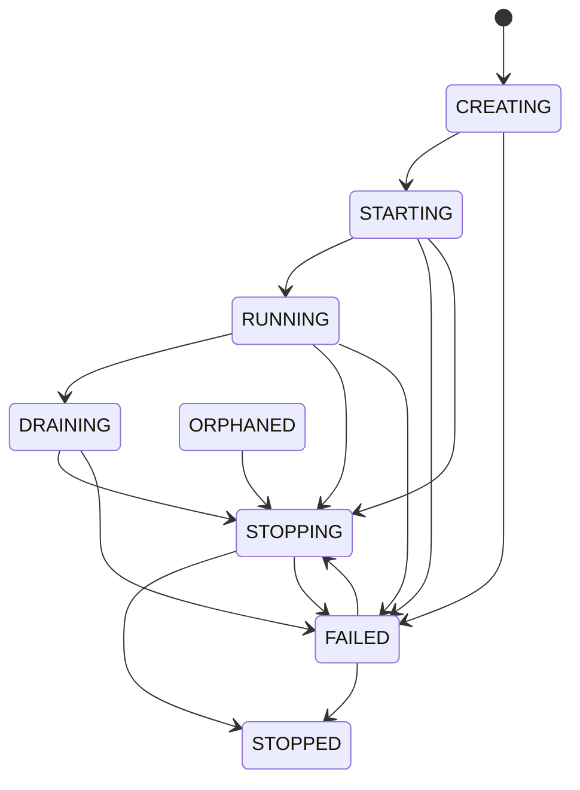
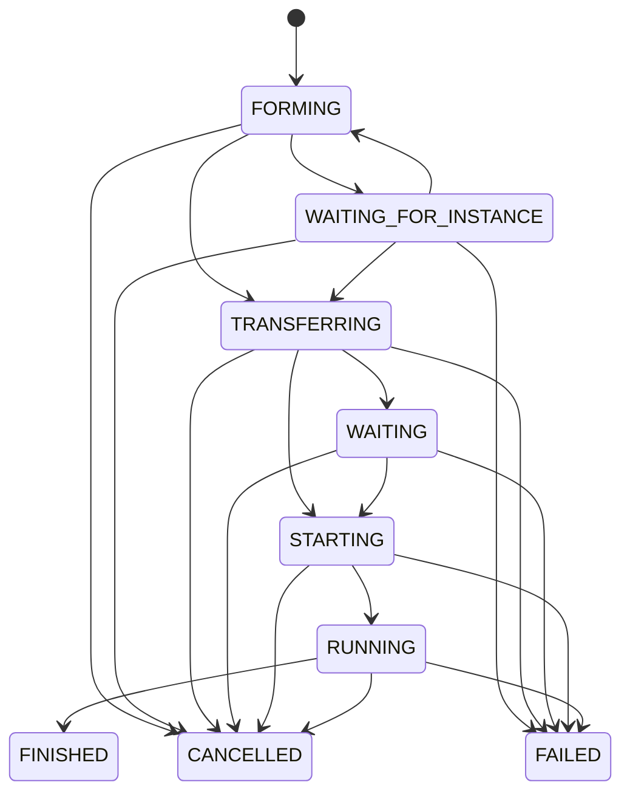

# Concepts

This guide defines the terms used by the code, dashboard, logs, and configuration files. Start
here before changing matchmaking or lifecycle behavior. Several states look similar but answer
different questions.

## Control plane and execution plane

The control plane is the central orchestrator and PostgreSQL. It decides desired capacity,
placement, sessions, transfers, and deadlines.

The execution plane is the set of host agents and their Docker daemons. It creates, inspects,
stops, and deletes containers requested by the control plane. An agent reports observations but
does not make placement or matchmaking decisions.

## Server group

A group is the unit of traffic policy. It has a stable identifier, a type, capacity bounds,
timeouts, and references to final variants.

EnderCloud supports two group types:

- A `hub` group runs shared lobby servers. It has player-routing limits and a maximum instance
  lifetime.
- A `minigame` group turns queued parties into isolated game sessions. It has matchmaking and
  team-balance rules.

Group configuration lives in `groups/*.yml`. The orchestrator validates and synchronizes it at
startup. See [the group reference](../groups/GROUP.md).

## Template layer and variant

A template layer is one immediate child directory of `templates/` containing `variant.yml`. Its
files may include a server JAR, plugins, configuration, and a world. Its descriptor may patch the
Docker image, CPU, memory, and container environment.

A final variant is a layer referenced by a group. It may list several parent layers. Parents are
ordered from broadest to most specific, then the final layer is applied last. Later files and
runtime fields replace earlier values.

Inheritance is flat. Parents cannot declare parents of their own. This rule keeps the effective
stack visible in one descriptor.

Three values distinguish variant content:

| Value | Meaning |
| --- | --- |
| Variant ID | Stable name used by groups, instances, logs, and container names |
| Revision | Positive operator-controlled version on a final variant |
| Checksum | SHA-256 value computed from effective descriptors and files |

The checksum detects the exact content. The revision says that an operator intends new instances
to use a new release. Increment the revision after changing any effective parent or final layer.
Running instances do not rematerialize their files.

Variant weights are relative selection weights inside one group. They are not percentages.
EnderCloud first favors variants that are underrepresented in the warm pool, then uses weights to
break the remaining choice.

See [the template and variant reference](../templates/VARIANT.md).

## Execution host

An execution host is a Docker machine identified by one stable `AGENT_ID`. The orchestrator keeps
two independent host states.

Health state describes connectivity and reconciliation:

| State | Meaning |
| --- | --- |
| `RECOVERING` | The agent is reachable, but inventory reconciliation has not completed |
| `ONLINE` | The agent is reconciled and may be eligible for placement |
| `OFFLINE` | Heartbeats and control contact have exceeded the host timeout |

Administration state describes operator intent:

| State | Meaning |
| --- | --- |
| `ACTIVE` | New placement is allowed when health is `ONLINE` |
| `DRAINING` | New placement is blocked while managed instances leave the host |
| `MAINTENANCE` | The host is empty and remains unavailable until reactivated |

CPU and memory are reservations, not live usage samples. Placement subtracts every reservation
that may still occupy the machine.

## Server instance

An instance is one desired Minecraft server and, while active, one Docker container. It records
the group, variant revision, host, resources, runtime path, endpoint, player count, and deadlines.

Lifecycle state answers, "Where is the runtime in its creation and removal process?"

`CREATING` means a durable create command exists or is executing. `STARTING` means Docker started
the container, but the Paper bridge has not yet published `SERVER_READY`. `RUNNING` begins only
after that event.

Availability state answers, "Can new work reserve this instance?"

- `OPEN` instances may count as warm capacity.
- `RESERVED` instances belong to a minigame session and cannot accept another session.

Availability normally moves from `OPEN` to `RESERVED`. Lifecycle and availability are separate so
a creating instance can already be held for one session without pretending that it is ready.

## Warm capacity

Warm capacity is the set of open instances ready or being prepared for new work.

- Warm ready means `RUNNING` and `OPEN`.
- Warm pending means `CREATING` or `STARTING`, and `OPEN`.

`minimum_warm_instances` is the floor maintained ahead of demand.
`maximum_warm_instances` stops the controller from keeping too many idle servers. The general
`minimum_instances` and `maximum_instances` bounds still apply to active lifecycle states.

For hubs, `target_players_per_instance` is a soft scale-out target over active and starting hubs.
`maximum_players_per_instance` is the hard routing limit for one running hub.

## Queue entry, party, and ticket

A queue entry is one attempt to join a minigame group. It contains a caller-supplied `partyId` and
one or more distinct player UUIDs.

The party is atomic. Matchmaking never splits its players between sessions or teams. The queue
entry identifier becomes the ticket identifier exposed in assignments. A later enqueue may reuse
the same `partyId`, so game plugins must use `ticketId` to distinguish separate attempts.

A player cannot belong to two active queue entries or sessions. Leaving a queue only removes an
entry that is still queued. It does not remove a player after selection into a session.

## Matchmaking profile

A matchmaking profile is a sorted list of team sizes that EnderCloud can build without splitting
any selected ticket. The configured team count and team size bound the list. Team-balance rules
can require a minimum size per team and limit the spread between the smallest and largest team.

EnderCloud sends feasible profiles and one recommended profile to Paper. The minigame plugin maps
the indivisible tickets to actual named teams. This division keeps game-specific team names and
spawn logic outside the orchestrator.

## Game session

A session is the durable lifecycle of one minigame match. It owns selected players, an optional
instance, assignment revisions, transfer progress, and acquisition or lobby deadlines.

The important ownership boundary is `STARTING`. Only the minigame plugin can publish
`GAME_STARTING`. The orchestrator finds feasible players and capacity, but it cannot know whether
the map, kits, or game-specific state are ready.

Backfill may add compatible tickets while the session is `FORMING`, `WAITING_FOR_INSTANCE`,
`TRANSFERRING`, or `WAITING`. `GAME_STARTING` closes backfill.

## Assignment and revision

An assignment is the Paper-facing view of a reserved session. It contains the session state,
expected and connected counts, selected tickets, feasible profiles, the recommended profile, and
two hints called `acceptingTickets` and `lockEligible`.

The assignment revision increases when its membership changes. The Paper bridge polls once per
second, caches the latest assignment, and acknowledges each new revision. A minigame plugin reads
that cache through `currentAssignment()` and must preserve already placed players when it handles
a newer revision.

`lockEligible` is a policy result, not permission to start. The minigame plugin still publishes
`GAME_STARTING` when its own prerequisites are ready.

## Player presence and transfer

EnderCloud tracks session membership separately from observed instance presence.

Session player state progresses through `SELECTED`, `TRANSFERRING`, `CONNECTED`, and `LEFT`.
Instance presence comes from Paper join, quit, and heartbeat events. The heartbeat carries the
complete observed player set and renews each player's stale deadline.

A transfer command is durable. Redis only delivers the request to Velocity. The orchestrator
retries the command until Velocity and Paper observations show progress or the transfer deadline
expires.

## Timeout and deadline

A timeout is a configured duration. A deadline is the absolute UTC timestamp persisted when an
operation enters the relevant step. Changing a group timeout does not rewrite existing deadlines.
New operations use the new duration after the group configuration is synchronized.

This distinction prevents restarts and configuration edits from silently granting more time to
work that is already late. See [the timeout reference](TIMEOUTS.md).

## Command and reconciliation

A command is a durable request for an external side effect, such as creating an instance. Its
state records whether the worker still needs to run it, is running it, or has completed it. The
command identifier also travels in HTTP headers and structured logs.

Reconciliation compares desired database state with the runtime inventory reported by an agent.
It handles missing desired containers, leftover owned containers, interrupted commands, and host
recovery. Reconciliation is what makes an uncertain process or network failure recoverable.

## Startup retry policy

Startup failure state belongs to a group, final variant, and revision. Failures before
`SERVER_READY` use exponential backoff based on `INSTANCE_START_RETRY_BASE_DELAY`. After more than
`INSTANCE_START_RETRY_LIMIT` counted failures, the policy becomes `BLOCKED` and stops new attempts
for that revision.

The final failed runtime and a bounded log tail remain available for diagnosis. An operator may
request a reset from the dashboard. Changing the final variant revision also moves the old policy
through cleanup so the new revision starts with a fresh history.

## Operational incident

An incident is a durable, deduplicated observation of an operational problem. Kinds cover blocked
capacity, repeated instance failures, unavailable hosts, stuck recovery or maintenance, repeated
transfer or command failures, and failed control loops.

Incidents progress from `PENDING` to `ACTIVE`, then `RESOLVED` when the condition clears. They are
grouped by a fingerprint so a repeating condition updates one record and its occurrence count
instead of creating a new row on every scheduler tick.

## Identifiers and names

Configuration identifiers contain 2 to 63 lowercase letters, digits, or dashes. Internal records
use generated identifiers. Operators should rely on the stable group, variant, and host IDs in
filters and automation.

Runtime names follow these conventions:

| Object | Format |
| --- | --- |
| Docker container | `endercloud-<variant-id>-<instance-id>` |
| Velocity server | `ec-<variant-id>-<instance-id>` |
| Agent template cache | `<layer-id>/<sha256-checksum>` |
| Instance runtime | `<runtime-directory>/instances/<instance-id>` |
